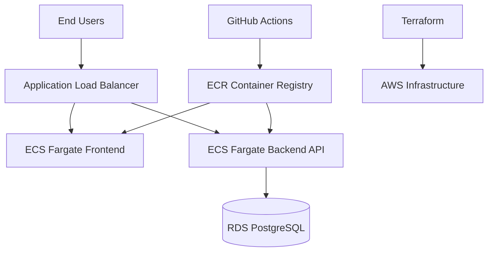

# AWS DevOps Assessment Deployment Documentation

## 1. Executive Summary
This project is a production-style cloud application deployment blueprint designed to deliver a full-stack web application to end users through AWS. It combines containerized application services, infrastructure-as-code, and automated CI/CD pipelines to provide a scalable and deployable platform for real-world use.

### What this solution delivers
- A user-facing frontend hosted on AWS
- A backend API connected to a managed PostgreSQL database
- Secure, private networking for application and data layers
- Automated image builds and deployment workflows through GitHub Actions
- Infrastructure provisioning using Terraform for repeatable cloud deployments

### Why it is ready to ship
- The application is containerized and cloud-native
- AWS services are provisioned in a structured and automated way
- The stack supports public access, private backend services, and data persistence
- CI/CD automation reduces manual deployment effort and speeds up releases

---

## 2. Production-Ready Architecture at a Glance

### Core platform components
- Frontend: Node.js/Express
- Backend: Python/FastAPI
- Database: Amazon RDS for PostgreSQL
- Compute: Amazon ECS Fargate
- Ingress: Application Load Balancer
- Container registry: Amazon ECR
- Automation: GitHub Actions + Terraform

---

## 3. Repository Deliverables

### Source code repository
- Contains frontend application code in `frontend/`
- Contains backend application code in `backend/`
- Includes deployment and operational configuration for the full solution

### Infrastructure code
- Terraform configuration is organized under `terraform/`
- Includes VPC, subnets, internet/NAT gateways, ECS, ALB, RDS, IAM, and Secrets Manager

### CI/CD pipeline configuration
- Application deployment workflow: `.github/workflows/deploy-app.yml`
- Infrastructure deployment workflow: `.github/workflows/deploy-infra.yml`

### Deployment documentation
- This document provides the architecture, rollout, and operational guidance for the platform

---

## 4. AWS Services Used

| Service | Role in the solution |
|---|---|
| Amazon VPC | Creates isolated network boundaries for the application and database |
| Internet Gateway | Enables internet access for public-facing services |
| NAT Gateway | Allows private resources to communicate outbound securely |
| Application Load Balancer | Routes traffic to frontend and backend services |
| Amazon ECS Fargate | Runs the frontend and backend containers without server management |
| Amazon ECR | Stores and versions application container images |
| Amazon RDS for PostgreSQL | Provides managed relational database services |
| AWS Secrets Manager | Stores sensitive configuration such as database credentials |
| IAM Roles | Secures access for ECS tasks and deployment services |
| S3 | Stores Terraform remote state |

---

## 5. Deployment Flow

### Application release flow
1. Code is pushed to the `main` branch.
2. GitHub Actions detects changes in application folders or workflow files.
3. The build pipeline authenticates to AWS and logs into ECR.
4. Frontend and backend images are built and stored in ECR.
5. The deployed ECS services can consume the updated container images for release.

### Infrastructure rollout flow
1. Changes in the `terraform/` folder trigger the infrastructure workflow.
2. Terraform initializes and validates the configuration.
3. A deployment plan is generated for review.
4. The provisioning workflow applies the infrastructure changes to AWS.

---

## 6. CI/CD Workflow Summary

### Infrastructure pipeline
File: `.github/workflows/deploy-infra.yml`

Key actions:
- Triggers on Terraform or workflow changes
- Sets up Terraform
- Runs initialization, validation, and planning
- Prepares the environment for infrastructure changes

### Application pipeline
File: `.github/workflows/deploy-app.yml`

Key actions:
- Triggers on push to `main`
- Builds frontend and backend Docker images
- Publishes images to Amazon ECR with commit-based tags
- Uses AWS credentials from GitHub Secrets

### Production-readiness note
This setup already demonstrates a strong DevOps foundation. To move from a solid implementation to a fully production-grade release pipeline, the next step is to add full deployment execution, approval controls, and promotion across environments.

---

## 7. Infrastructure Provisioning Approach
Infrastructure is provisioned through Terraform using a declarative model.

### What is provisioned
- VPC with public and private subnets
- Internet Gateway and NAT Gateway
- Application Load Balancer and routing rules
- ECS cluster and Fargate services
- ECR repositories
- RDS PostgreSQL instance
- Secrets Manager secret for database credentials

### Why this matters
- Deployments are repeatable
- Infrastructure changes are version-controlled
- The environment can be recreated or scaled consistently

---

## 8. Security and Reliability Baseline

### Security posture
- Private application and database layers reduce direct exposure to the internet
- Security groups restrict traffic to required paths only
- ECS services use dedicated IAM roles
- Sensitive database credentials are managed through AWS Secrets Manager

### Reliability posture
- Application traffic is distributed through the ALB
- Health checks support service monitoring and failover decisions
- Container-based deployment supports rapid updates and recovery

### Recommended production hardening next steps
- Use GitHub OIDC instead of long-lived AWS access keys
- Enable encryption at rest for persistent data and container artifacts
- Add WAF protection in front of the ALB
- Introduce staging and production environments with approval gates

---

## 9. Rollback and Recovery Strategy

### Application rollback
- Revert the application code in Git
- Rebuild and republish the last known-good image version from ECR
- Redeploy the previous image tag to ECS

### Infrastructure rollback
- Revert Terraform changes
- Re-apply the prior configuration from version control and Terraform state

### Recovery principle
- The deployment process is designed so that previous known-good versions can be restored quickly if an issue is detected after release

---

## 10. Production Readiness Snapshot

### Ready to be shipped
- Cloud-native architecture is in place
- Infrastructure is codified and reusable
- Application services are containerized and deployable
- CI/CD automation is already established
- Security and networking foundations are present

### What remains for full enterprise rollout
- Add automated deployment execution for ECS updates
- Add Terraform apply into the release workflow
- Add environment promotion for dev/staging/prod
- Add monitoring, logging, and alerting for production operations

---

## 11. Final Release Statement
This AWS-based deployment solution is structured as a production-ready application platform that can be delivered to users through the cloud. It provides the core building blocks of a real-world release pipeline: scalable architecture, secure networking, managed data services, automated delivery, and infrastructure as code. With a few final hardening steps, it is well-positioned to move from assessment-grade implementation to a fully operational production deployment.
