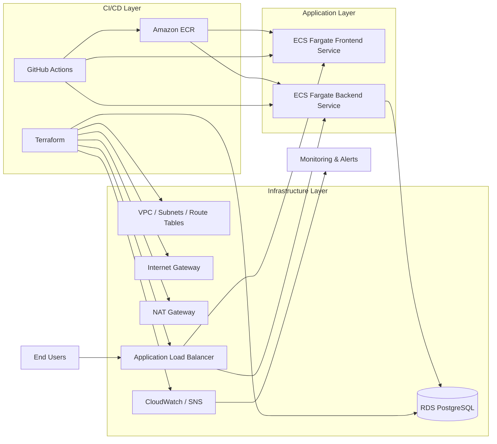

# AWS DevOps Assessment Deployment Documentation

## 1. Executive Summary
This project is a production-style cloud application deployment blueprint designed to deliver a full-stack web application to end users through AWS. It combines containerized application services, infrastructure-as-code, and automated CI/CD pipelines to provide a scalable and deployable platform for the real-world use case.

### What this solution delivers
- A user-facing frontend hosted on AWS
- A backend API connected to a managed PostgreSQL database
- Secure, private networking for application and data layers
- Automated image builds and deployment workflows through GitHub Actions
- Infrastructure provisioning using Terraform for repeatable cloud deployments

### Why it is ready to ship
- The application is containerized and cloud-native
- AWS services are provisioned in a structured and automated way
- The stack supports public access, private backend services, and data persistence
- CI/CD automation reduces manual deployment effort and speeds up releases

---

## 2. Architecture Overview

### Reference Architecture Diagram

### Architectural Explanation
The architecture is organized into three distinct layers to clearly represent the solution design:

- Infrastructure Layer: provisions the AWS foundation such as VPC, subnets, route tables, load balancer, RDS, and monitoring services.
- Application Layer: hosts the frontend and backend applications as containerized services on ECS Fargate.
- CI/CD Layer: automates the build, packaging, deployment, and rollout process through GitHub Actions and Terraform.

### How this diagram maps to the actual project
- The frontend and backend containers are deployed through ECS services.
- The Application Load Balancer exposes the services to end users.
- The database is not directly exposed to the internet and remains in the private layer.
- GitHub Actions acts as the CI/CD orchestration layer.
- Terraform provisions the entire cloud foundation before application deployment begins.

---

## 3. Application Deployment Flow

### Frontend and Backend Services
The project includes two containerized services:
- Frontend: a Node.js/Express application
- Backend: a Python/FastAPI application

Both services are packaged into Docker containers and deployed onto ECS Fargate, which provides serverless container execution without managing EC2 instances.

### Deployment Sequence
1. Developers push code changes to the repository.
2. GitHub Actions triggers the application workflow.
3. Docker images are built for the frontend and backend.
4. Images are pushed to Amazon ECR.
5. ECS services are updated with a force-new deployment so the new images become active.
6. The Application Load Balancer routes traffic to the updated services.

This flow demonstrates a practical CI/CD pattern where source changes are turned into deployed AWS application containers automatically.

---

## 4. Infrastructure Deployment Flow

### Infrastructure as Code Approach
The cloud environment is provisioned using Terraform, which ensures that infrastructure is repeatable, version-controlled, and easier to manage than manual AWS setup.

### Infrastructure Components Provisioned
The Terraform configuration establishes the following core AWS resources:
- VPC with public and private subnets
- Internet Gateway and NAT Gateway
- Route tables and subnet associations
- ECS cluster and Fargate services
- Application Load Balancer and target groups
- ECR repositories for frontend and backend images
- RDS PostgreSQL database instance in private subnets
- CloudWatch log groups and SNS-based alerting

### Deployment Sequence
1. Terraform reads the infrastructure configuration from the repository.
2. The infrastructure workflow runs in GitHub Actions.
3. Terraform initializes the backend and validates the configuration.
4. Terraform creates or updates the required AWS resources.
5. The infrastructure becomes available for application deployment.

This shows the separation between platform provisioning and application deployment, which is critical in real-world DevOps environments.

---

## 5. CI/CD Pipeline Design

### Infrastructure Pipeline
File: .github/workflows/deploy-infra.yml

Purpose:
- provisions or updates the AWS environment through Terraform
- runs on changes under the terraform directory
- performs Terraform initialization, planning, and apply

### Application Pipeline
File: .github/workflows/deploy-app.yml

Purpose:
- builds and publishes the frontend and backend container images
- pushes the images to Amazon ECR
- updates ECS services so new application versions are deployed

### Pipeline Flow for Evaluation
A reviewer can clearly see the following end-to-end flow:
1. GitHub repository receives a change.
2. The relevant GitHub Actions workflow starts.
3. Infrastructure or application artifacts are produced.
4. AWS resources are updated accordingly.
5. The deployed application becomes available through the load balancer.

This demonstrates both DevOps automation and cloud deployment maturity.

---

## 6. AWS Services Used

| Service | Role in the solution |
|---|---|
| Amazon VPC | Creates isolated network boundaries for the application and database |
| Internet Gateway | Enables internet access for public-facing resources |
| NAT Gateway | Allows private subnet resources to reach the internet securely |
| Application Load Balancer | Routes external traffic to the frontend and backend services |
| Amazon ECS Fargate | Runs the containerized frontend and backend workloads |
| Amazon ECR | Stores and versions container images |
| Amazon RDS for PostgreSQL | Provides managed relational database services |
| IAM Roles | Grants permissions to ECS tasks and deployment workflows |
| CloudWatch | Stores logs and monitors system behavior |
| SNS | Sends alert notifications for monitoring events |
| S3 | Stores Terraform remote state |

---

## 7. Security and Reliability Considerations

### Security posture
- Public and private application layers are separated through the VPC design.
- Security groups restrict allowed traffic to required services only.
- ECS services run with defined IAM permissions.
- Database resources are placed in private subnets to reduce direct exposure.

### Reliability and observability
- Load balancing helps distribute traffic and improve service resilience.
- CloudWatch log groups provide runtime diagnostics.
- SNS-based alerts help monitor service health and failure conditions.

### Key takeaways
This implementation reflects a strong foundation for a production-style deployment architecture by combining networking, security, automation, monitoring, and scalability.

---

## 8. Rollback and Recovery Strategy

### Application Rollback
- Revert to the previous code version in Git.
- Rebuild and redeploy the last known-good image from ECR.
- Trigger a new ECS deployment using the previous image tag.

### Infrastructure Rollback
- Revert Terraform changes in source control.
- Apply the earlier configuration to restore the intended infrastructure state.

### Operational value
This approach allows the platform to recover quickly from deployment issues and supports a safer release process.

---

## 9. Final Summary
This project presents a complete AWS DevOps implementation that covers the core stages of modern cloud deployment:
- Provisioning infrastructure with Terraform
- Packaging applications in containers
- Storing images in Amazon ECR
- Deploying services to ECS Fargate
- Routing traffic through an Application Load Balancer
- Integrating monitoring and alerting with CloudWatch and SNS
- Automating the process with GitHub Actions

From a DevOps perspective, this solution demonstrates practical understanding of cloud architecture, automation, infrastructure provisioning, deployment pipelines, and production-oriented system design.
